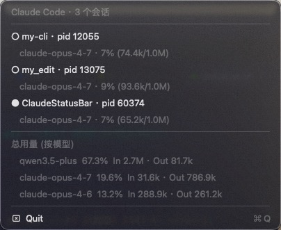

# ClaudeStatusBar

一个轻量级的 macOS 菜单栏 App，用来盯着本机正在跑的 [Claude Code](https://claude.com/claude-code) CLI 会话。



- **会话总览**：当前所有 CLI 会话（pid、cwd、状态），按项目目录展示。
- **状态指示**：菜单栏图标在 _idle / working / waiting_ 三种状态下变色（黑/橙/黄）。
- **等待提醒**：任意会话进入 `waiting`（CLI 弹了确认对话框）时立刻发送系统通知，省得切回 Terminal 才发现。
- **状态栏授权**：右上角弹一个浮动小面板，带 **允许 / 拒绝** 按钮（Return / Esc 也可），单击直接回应 CLI 的权限请求，不用切回 Terminal。注册一次 `PermissionRequest` hook 即可，对 vanilla `claude` 直接生效；详见 [docs/permission-prompt.md](docs/permission-prompt.md)。
- **上下文用量**：每条会话显示当前模型 + 上下文窗口占用百分比（读 `~/.claude/projects/.../*.jsonl` 最近一条 assistant 消息）。
- **累计用量**：菜单底部按模型聚合 token 总量与占比（实时扫描 `~/.claude/projects/`，不依赖 stats 缓存）。

## 系统要求

- macOS 13 (Ventura) 及以上
- 已安装并运行过 Claude Code CLI（依赖它在 `~/.claude/sessions/` 和 `~/.claude/projects/` 下写入的文件）

## 安装

### 从 Releases 下载（推荐）

1. 到 [Releases](https://github.com/hadesh/ClaudeStatusBar/releases) 下载最新的 `ClaudeStatusBar-x.y.z.zip`。
2. 解压后把 `ClaudeStatusBar.app` 拖进 `/Applications`。
3. **首次打开**：直接双击会被 Gatekeeper 拦截（“无法打开，因为开发者无法验证”）。在 Finder 里 **右键 → 打开**，弹窗里再点“打开”即可。这一步只需要做一次。

> App 是 ad-hoc 签名的（未付费 Apple Developer 签名，也未做公证）。如果不放心可以跳过下载、自行从源码构建。

### 从源码构建

```bash
git clone https://github.com/hadesh/ClaudeStatusBar.git
cd ClaudeStatusBar
./scripts/package.sh                # 产物在 dist/ClaudeStatusBar.app
open dist/ClaudeStatusBar.app
```

或者直接跑（不打包，开发模式）：

```bash
swift run
```

> 注意：`swift run` 启动时没有 bundle identifier，系统通知会降级为 `osascript display notification`。打成 `.app` 之后才会用 `UNUserNotificationCenter`。

## 开发

```bash
swift build         # 编译
swift test          # 跑全部测试
swift test --filter ClaudeStatusBarTests.SessionTests   # 单个 suite
```

代码结构和数据流见 [CLAUDE.md](CLAUDE.md)。

## 卸载

退出菜单栏图标（点击 → Quit），把 `/Applications/ClaudeStatusBar.app` 扔进废纸篓即可。开启了状态栏授权功能的话，再删一下 `~/Library/Application Support/ClaudeStatusBar/`（里面只有一个 socket 文件），并把 `~/.claude/settings.json` 里 `hooks.PermissionRequest` 那一段对应条目移除。

## License

[MIT](LICENSE) © 2026 Hades
